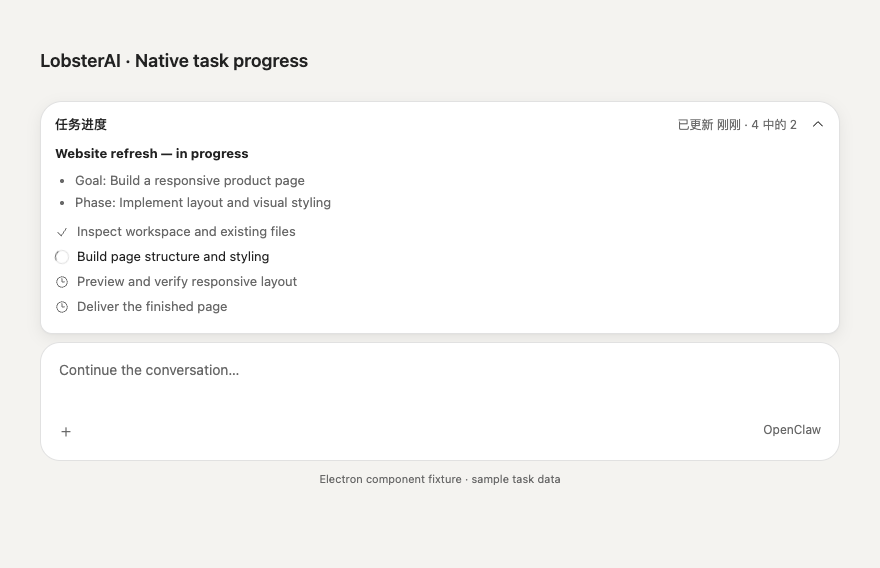

# Native OpenClaw progress cards in Cowork

Cowork displays the persisted OpenClaw progress card above the existing composer and its question/queue controls. This is a React port of OpenClaw `v2026.8.1`'s `ui/src/components/session-progress-card.ts` and associated styles, at commit `ea806575e6450e4d1efdfc72c19f04be982a1b9b`. The upstream MIT notice is retained in `third-party-notices/openclaw-progress-card-LICENSE.txt`.

## Data and interaction contract

- The main process resolves a local Cowork session ID to its native session key. Narrow IPC exposes read, completed-card dismissal, and invalidation notifications; requests are restricted to the main window's main frame and a known local session.
- `progressCard.get` reads native persistence on session entry and Gateway reconnection. `progressCard.changed` triggers a fresh read. Chat history is not used to reconstruct cards.
- Card Markdown and step states remain authoritative. Markdown-only and steps-only cards are supported. Completion is never inferred from a stopped or failed turn.
- New incomplete cards expand by default. Updates preserve the user's collapse choice. The compact heading uses the current step and its actual position. Long content scrolls internally; narrow layouts, dark themes, and reduced motion are supported.
- A failed read retains the last card and exposes retry; a successful empty response removes it. Request generations and connection/session checks discard late responses.
- Dismissal requires completed steps and uses `expectedRevision`. A concurrent native update is retained instead of accidentally cleared.
- Raw HTML is disabled. Only validated numeric `<progress>` elements are admitted. Remote images are not loaded, and clicked links are restricted to HTTP(S) through the existing external-link bridge.

## Creating progress during ordinary tasks

Each outbound turn asks the agent to create and maintain a native plan for multi-action work. Prompting alone does not guarantee tool use. After two distinct tool starts in the current, non-stopped run, the adapter can create a factual Markdown-only activity card. It does not manufacture a goal, steps, completion, or percentage. Native `progress_card` activity takes ownership; historical, duplicate, and late events cannot create a fallback.

The version-scoped patch `scripts/patches/v2026.8.1/zz-openclaw-progress-card-activity.patch` adds optional `ifAbsent` to `progressCard.put`. The check and write happen in the native SQLite transaction. Existing cards and cleared-card tombstones both win, preventing the fallback from overwriting a plan or resurrecting a dismissed card. The fallback is therefore not a new plan for every subsequent turn in an existing session: those plans remain the agent's responsibility.

No OpenClaw version upgrade or active refresh-task feature is introduced. Main, preload, and the patched bundled runtime must ship together in a full desktop release.

## Validation

- 302 targeted tests across the runtime adapter, main bridge, renderer subscription, component, and Markdown renderer.
- 19 native progress store/Gateway tests on the clean pinned OpenClaw source with the new patch applied.
- Changed-file ESLint with zero warnings; renderer and Electron TypeScript checks; production renderer build and Electron compilation.
- An isolated Electron component fixture with invented task data verified collapse preservation after an update, stopped state, and a 390px dark layout without horizontal overflow. Screenshots below show the actual card component with a simplified composer fixture, not a live model session.

Live model end-to-end behavior and packaged restart/reconnect acceptance still need upstream validation. Automated tests cover reconnect, session switching, reordered responses, empty cards, failure retention, and revision conflicts. The native patch was tested separately against the pinned source, not with the entire upstream patch stack.

