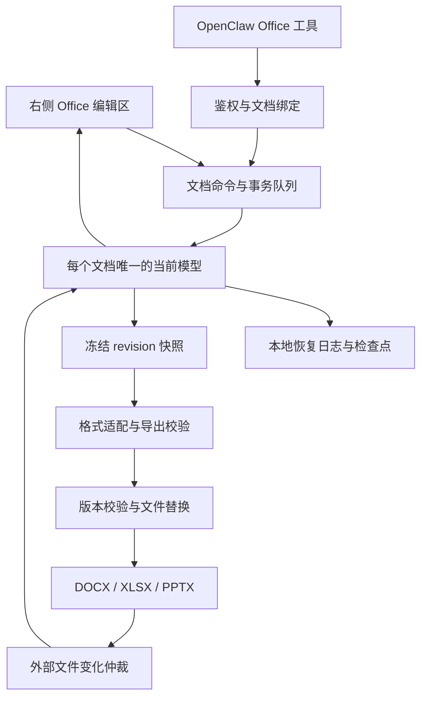

# LobsterAI 本地 Office 实时编辑方案：商业发行与 MIT 开源

日期：2026-09-13。本文保留最初设计与许可审查基线；后续已实施 Word 第一阶段，实际依赖、功能范围和验证情况见 [Word 编辑第一阶段实现记录](./2026-09-13-word-editing-stage1.md)。以下设计阶段记录不应视为三种格式均已实现。

最初审查核对了当时 LobsterAI 源码、此前安装包分析、官方许可条款，并在临时目录解析候选依赖树、检查 183 个锁定依赖的 npm 发布包及许可材料；当时没有把依赖安装到 LobsterAI，也没有进行 Office 文件往返实测。许可判断用于技术选型，不能代替实际发行物料和剩余例外的最终复核。

## 1. 推荐决策与适用前提

采用 **LobsterAI 自有文档会话、保存恢复和 Agent 编辑协议，加上按格式选择的开源内核**。三个格式共用操作和生命周期接口，保留各自的数据模型；不把 Word、Excel、PPT 强行转成一种通用 JSON。

确定的产品约束是：**LobsterAI 要商业发行，同时自有代码继续以 MIT 开源。** 排除腾讯、飞书内部 SDK。默认采用 MIT、Apache-2.0、BSD、ISC 等允许商业分发的组件，第三方代码继续保留原许可证及 notices；不能把整个安装包声称为只有 MIT 许可。

工程上同时以本地编辑为目标：文件打开、人工编辑和保存可以离线完成；不要求用户安装 Microsoft Office、WPS、Docker 或部署文档服务器。开源版应能构建并使用基础 Office 编辑，不依赖厂商商业 license key。AI 模型调用是否联网由当前模型配置决定。这是推荐的产品边界，不是 MIT 强制要求所有依赖都必须免费或离线。

建议的首版产品定位是：在右侧直接编辑常见 DOCX、XLSX、PPTX，AI 能修改同一份正在显示的文档，自动保存并能恢复，明确限制尚不能安全往返的操作。任意复杂 Office 文件与 Microsoft Office 完全一致，是另一档长期工程目标，不能用“接入三个前端组件”作为承诺。

| 格式 | 推荐技术方向 | LobsterAI 自研重点 |
| --- | --- | --- |
| DOCX | 优先验证 EigenPal `core/react/i18n` 2.17.0 的 Apache-2.0 部分，明确排除 `pro/editor-api` | 本地宿主、字体服务、持久化恢复、版本化编辑工具、兼容性判定；按验证结果补充开源核心 |
| XLSX | Univer 0.25.1 的 Apache-2.0 Sheets 核心和基础公式组件；逐包选择 | 本地 OOXML 导入、操作到原文件的增量写回、公式及引用处理、兼容性保护 |
| PPTX | 基于 MIT Konva 的自有对象编辑器，文本输入使用 DOM 编辑层 | 幻灯片场景模型、母版及主题映射、文本和图片编辑、OOXML 读写及原对象保留 |
| 字体 | 独立管理经过核对的 OFL 字体，如 Noto CJK；字体保持 OFL | 本地字体解析、替代字体度量、中文排版、字体许可随包交付 |
| 公共层 | TypeScript、现有 Electron IPC、SQLite、Worker | 文档注册表、命令事务、保存协调、恢复日志、文件变更仲裁、Agent 接口 |

表中的版本是本次审查基线，不是已经通过运行验收的生产依赖。架构可以确定，具体内核在许可材料补全、兼容性原型通过后定版。MIT 与商业发行并不要求把文字排版、表格网格和公式计算全部自研；优先自研对 LobsterAI 价值最大的公共层与缺失的文件适配。PPT 是自研量最大的部分，应在早期验证其格式与布局风险，按功能边界逐步发布。

## 2. 商业使用、MIT 范围与具体组件结论

### 2.1 MIT 主仓库与第三方许可如何共存

MIT 允许使用、修改、分发及销售软件副本，并要求保留版权及许可声明。Apache-2.0 也允许商业使用和分发，要求附带许可证、保留适用声明、标记修改，并按条件保留 NOTICE。使用 Apache 组件，不会仅因调用其接口就要求 LobsterAI 自有代码全部改成 Apache；但原组件的义务也不会因为主仓库写了 MIT 而消失。来源：[MIT 正文](https://opensource.org/license/mit)、[Apache-2.0 正文](https://www.apache.org/licenses/LICENSE-2.0)、[Apache 官方 FAQ](https://www.apache.org/foundation/license-faq.html)。

建议采用明确的许可范围：

| 内容 | 许可与交付方式 |
| --- | --- |
| LobsterAI 自己编写的会话、保存、工具、文件适配和产品 UI | 继续 MIT；保留现有根 LICENSE 和明确的适用范围说明 |
| 调用的第三方组件 | 各自保留 MIT、Apache-2.0 等许可，随源码或安装包提供适用声明 |
| 对 Apache 内核做的补丁或裁剪源码 | 默认在该第三方目录继续保留 Apache-2.0、版权与修改说明；不一键改为只有 MIT |
| 字体、WASM、图标、模板及其他资源 | 单独登记来源、版本、许可与分发条件，不由 npm 包的顶层许可推定 |
| 用户导出的 Office 文档 | 不会仅因使用这些编辑器就必须采用 MIT/Apache；内嵌字体、图片等素材仍应符合其许可 |

MIT 也允许下游商业使用和再分发已经开源的代码。商业化可围绕官方产品、托管模型、企业服务与支持展开；不能通过额外的商业条款把已授予的 MIT 权利收回。Apache 的专利许可有范围和终止条件，也不授予随意使用上游商标的权利；本方案不把“许可允许商用”扩张成专利、品牌或所有内容来源的全面保证。

### 2.2 组件逐项结论

| 组件/范围 | 本次核对的许可 | 能否用于商业产品 | 本项目决定 |
| --- | --- | --- | --- |
| EigenPal `core/react/i18n` 2.17.0 | Apache-2.0；core 内的 HarfBuzz/harfbuzzjs 另有声明 | 按对应条款可以 | 保留为 Word 首选验证候选，只引入这组已明确许可的包 |
| EigenPal `pro/editor-api` | EigenPal Pro Evaluation License | 现有评估条款不允许生产使用或对外分发；需要另行书面商业授权 | 不进入默认依赖、源码镜像或安装包；AI 接口由我们独立实现 |
| Univer 0.25.1 开源 Sheets 相关包 | Apache-2.0，另有传递依赖许可 | 按对应条款可以 | 使用固定包清单，自己实现本地 Office 文件适配 |
| Univer `@univerjs-pro/*` 与官方商业转换能力 | 不能从开源仓库 Apache 标识推定许可 | 需逐项核对商业条款与授权 | 默认不引入，不依赖其导入导出服务 |
| Konva 10.5.0 | MIT | 可以 | 使用浏览器入口，自研 PPT 编辑层；不默认打包可选 Node 原生画布后端 |
| PptxGenJS 4.0.1 | MIT；部分传递依赖有独立声明 | 按对应条款可以 | 可选，仅辅助新建 PPT 导出；发布前处理依赖声明和最终打包范围 |
| fflate 0.8.3 / fast-xml-parser 5.11.1 | MIT，解析器有传递依赖 | 按对应条款可以 | 可作为自研 OOXML 适配的基础工具，随包保留适用声明 |
| EigenPal 整体字体包 2.17.0 | Apache-2.0 AND OFL-1.1 AND GUST Font License，后者引用 LPPL | 不能按单一 Apache 结论处理，字体须满足各自条款 | 默认不整体引入；改用独立整理的字体集，减少许可和体积复杂度 |
| Noto CJK 字体 | SIL OFL-1.1 | 允许随商业软件分发并保留相应许可 | 作为中文字体候选；字体保持 OFL，修改/子集化时核对保留字体名要求 |

许可证据：[EigenPal 范围声明](https://raw.githubusercontent.com/eigenpal/docx-editor/main/LICENSE)、[商业评估条款](https://raw.githubusercontent.com/eigenpal/docx-editor/main/packages/editor-api/LICENSE.md)、[Univer 开源许可](https://raw.githubusercontent.com/dream-num/univer/dev/LICENSE)、[Konva 许可](https://raw.githubusercontent.com/konvajs/konva/master/LICENSE)、[PptxGenJS 许可](https://raw.githubusercontent.com/gitbrent/PptxGenJS/master/LICENSE)、[字体包定义](https://raw.githubusercontent.com/eigenpal/docx-editor/main/packages/fonts/package.json)、[Noto CJK Sans 许可](https://raw.githubusercontent.com/notofonts/noto-cjk/main/Sans/LICENSE)、[OFL 正文](https://openfontlicense.org/open-font-license-official-text/)。固定发布包的哈希及声明位置见本方案的审查记录。

**GPL/AGPL 并不禁止商用。** 这里不选择它们，是为了避免默认 Office 功能给商业安装包和下游增加相应源码提供及组合分发义务，不能说成“AGPL 一律不能商用”或“主仓库写 MIT 就可以忽略 AGPL”。MPL/LGPL 也不是自动不可用，需按具体集成方式履行相应义务；默认新增 Office 依赖优先选上述宽松许可。来源：[GNU 许可 FAQ](https://www.gnu.org/licenses/gpl-faq.en.html)、[GNU 对 AGPL 的说明](https://www.gnu.org/licenses/why-affero-gpl.html)、[Mozilla MPL FAQ](https://www.mozilla.org/en-US/MPL/2.0/FAQ/)。

### 2.3 技术能力仍须独立验证

**Word。** EigenPal 开源核心声明提供 OOXML 解析、序列化、文档树和排版；React 接口有文档 revision、保存回调、导出及 typed command 入口，因此比从通用富文本编辑器开始补齐 DOCX 更值得优先验证。但 Apache 部分允许商用，不等于该部分已经覆盖全部需求。LobsterAI 应基于公开的开源核心接口独立编写自己的 Agent facade，不复制受限目录的实现。来源：[核心包定义](https://raw.githubusercontent.com/eigenpal/docx-editor/main/packages/core/package.json)、[React 接口](https://www.docx-editor.dev/docs/2.x/react/props)。

第一轮必须证明：中文输入和撤销正常、真实 DOCX 往返、操作可定位到稳定对象、能恢复编辑状态、保存可以对应确定 revision、无 Pro 包时所需功能成立。官方关于保真和分页的描述只能作为测试线索。其文档说明，无 Pro 模块时可以保留已有修订和批注，但管理这些内容需要对应模块；首版不把这项能力列为已经具备。字体加载还可能引发重新分页及撤销历史变化，因此应在允许输入前完成关键字体准备。来源：[模块与字体说明](https://www.docx-editor.dev/docs/2.x/react/props)。

如开源核心不能达到准入要求，先评估小范围修补；涉及重新实现分页、排版或大规模改造文档树时，应重新评估 Word 阶段成本。不能一边沿用“接入成本低”的估算，一边实际承担重写引擎的工作。

**Excel。** 复用 Univer 开源表格核心，但单独实现本地文件通道。当前官方 Office 导入导出文档要求转换后端，snapshot 模式也没有消除这一要求；示例涉及 `@univerjs-pro/*`。因此不能把“能编辑工作簿 JSON”视为“已有免费离线 XLSX 往返”。接入时按具体包和固定版本核对能力，不直接引入包含商业插件的高级预设。本次 npm 审查使用 0.25.1，而查阅的网站文档版本为 v1.0.0-rc.0；原型必须以实际锁定版本的代码/API 为准，不能混用不同版本文档。来源：[开源仓库](https://github.com/dream-num/univer)、[Sheets 核心](https://docs.univer.ai/guides/sheets/features/core)、[导入导出说明](https://docs.univer.ai/guides/sheets/features/import-export)。

**PPT。** 当前 Univer 完整 Slides 文档使用 `@univerjs-pro/slides`、`slides-ui` 及许可组件；不能因为历史仓库里有开源 Slides 目录，就认定当前完整方案都能免费使用。建议采用 Konva 提供选择、拖动、缩放等画布基础，自研幻灯片模型与文件映射。中文文本编辑使用 DOM 输入层，并保证输入层与显示层的字体、换行和几何计算一致。来源：[Univer Slides 当前接入](https://docs.univer.ai/guides/slides/features/core)、[Konva 许可证](https://raw.githubusercontent.com/konvajs/konva/master/LICENSE)。

新建且结构由我们控制的演示文稿，可以用 PptxGenJS 辅助生成；已有 PPTX 应保留原包并修改对应对象，不能统一重建整份演示文稿。这样可以降低母版、关系、动画和嵌入对象被遗漏的风险。来源：[PptxGenJS](https://github.com/gitbrent/PptxGenJS)、[创建文稿接口](https://gitbrent.github.io/PptxGenJS/docs/usage-pres-create/)。

其他路线的取舍：

| 路线 | 当前不作为默认方案的原因 |
| --- | --- |
| ONLYOFFICE Docs | 成熟的三格式候选，但开源核心涉及 AGPL，常规 Docs 集成还需要文档服务及保存回调；许可路线、部署形态和纯本地桌面集成需单独决策。不能仅靠进程分离就认定不存在许可义务 |
| Collabora Online / LibreOffice 系 | 是可评估的成熟替代方向；Online 的标准部署依赖 Linux 服务环境，LibreOffice SDK 则基于完整 LibreOffice 安装。跨平台嵌入、进程和包体维护并不会因存在 API 而消失 |
| SuperDoc、PPTist | 不能一概当成 MIT 依赖。当前 SuperDoc DOCX engine 有独立商业条款，PPTist 仓库许可证为 AGPL；不纳入本提案默认依赖集合 |
| 从零实现三套完整 Office 内核 | 排版、公式、文件格式和对象兼容性投入过大；先自研公共层和缺失的文件适配，而不是同时重写三个完整内核 |

对应来源：[ONLYOFFICE 核心许可证](https://raw.githubusercontent.com/ONLYOFFICE/sdkjs/master/LICENSE)、[保存流程](https://api.onlyoffice.com/docs/docs-api/get-started/how-it-works/saving-file/)、[Collabora FAQ](https://www.collaboraonline.com/faqs/)、[LibreOffice SDK 安装依赖](https://api.libreoffice.org/docs/install.html)、[SuperDoc engine 许可](https://docs.superdoc.dev/resources/docx-engine-license/)、[PPTist 许可证](https://raw.githubusercontent.com/pipipi-pikachu/PPTist/master/LICENSE)。

若将来需要商业内核覆盖复杂文档，可作为另行授权的可选适配器评估，并明确合同是否允许随商业安装包分发、是否允许开源用户取得和使用；不能认为我们买了一个 license，下游 MIT 用户也自动获得该厂商商业权利。基础 Office 路径保持独立可用。

### 2.4 发布包与传递依赖审查结果

本轮在 `/private/tmp/lobster-office-license-immnaro9` 生成了独立的候选依赖锁文件，没有创建该目录下的 `node_modules`。锁定 183 个包，下载并校验了 183 个发布包的完整性，提取 LICENSE、NOTICE、README 许可片段和二进制资源清单；另外检查了字体包等可选候选。

声明统计包括 MIT、Apache-2.0、BSD-3-Clause、ISC、0BSD、`MIT OR GPL-3.0-or-later`、`MIT AND Zlib`，以及一项缺失的元数据许可。这个统计是候选集的包元数据分布，不是对 LobsterAI 全仓库或实际安装包的“全部合规”结论。

需要写入依赖准入记录的具体发现：

| 发现 | 处理 |
| --- | --- |
| `@univerjs/telemetry` 元数据没有 license 字段，但发布包有 Apache-2.0 LICENSE | 以实际材料记录许可并保留声明；元数据为空不能直接判为无许可或自动通过 |
| JSZip 是 `MIT OR GPL-3.0-or-later` | 选择 MIT 分支并保留对应声明；OR 不意味着必须同时承担 GPL |
| pako 是 `MIT AND Zlib` | 同时保留适用的两份声明；AND 不能当成二选一 |
| `isarray`、`ot-json1`、`unicount` 的完整许可在 README | 在构建裁剪 README 前收集许可片段 |
| `@nodable/entities`、`franc-min` 的完整许可未随 tarball 提供 | 已从 npm gitHead 对应的官方源码提交定位许可，发行时补入对应声明 |
| `react-remove-scroll-bar` 2.3.8 仅定位到 MIT 标识，完整版权许可材料仍需补齐 | 作为发版前待处理项，补齐版本对应材料或替换相关依赖 |
| PptxGenJS 带入的 `https` 1.0.0 占位依赖仅有 ISC 元数据声明 | 验证浏览器产物确实不包含该包，或在合规维护的分支移除/替换；若仍分发则需补齐材料 |
| `ot-text-unicode` 4.0.0 元数据为 ISC，README 有 MIT 全文 | 记录并确认实际适用声明，保留已观察到的许可材料；不能只信元数据自动归类 |
| EigenPal core 含内嵌 HarfBuzz WASM | 保留 core 的 THIRD_PARTY_NOTICES 和 HarfBuzz-COPYING，不能只带一份 Apache LICENSE |

审查结果支持主技术路线，但尚有上述发行声明例外。没有对每一行源码的来源、所有潜在专利、实际平台构建产物做全面核验，也没有把完整性哈希当成安全或权属保证。

机器可读证据：[183 个候选包与例外记录](/Users/wangning/Dev/test3/LobsterAI/specs/features/office-editing/2026-09-13-office-license-review.json)。其中记录候选根依赖、确切版本、完整性值、tarball SHA-256、许可文件位置和后续动作；它不是正式发行 SBOM。

## 3. 当前 LobsterAI 的基础与缺口

| 现有入口 | 核对结论 | 本方案中的处理 |
| --- | --- | --- |
| `DocumentRenderer.tsx` | DOCX 和 PPTX 使用预览库 | 按格式和文件能力分流到新的编辑宿主，保留只读路径 |
| `sheet/SheetFallbackRenderer.tsx` | 工作簿被转成展示用单元格，使用格式化文本；不是完整可写工作簿 | 继续承担预览，另建工作簿模型和编辑器 |
| `markdownDocument.ts` | 已有组件外的文档状态、草稿、自动保存和冲突处理 | 沿用生命周期原则；Office 不复用文本草稿的存储格式 |
| `markdownFileEditing.ts` | 已有版本校验、串行写入、同目录临时文件与替换 | 按二进制快照和保存收据设计 Office 写回服务 |
| `ArtifactPanel.tsx` | 监听到文件变化后调用刷新；Office 刷新会读取 data URL | 编辑中的 Office 改由会话仲裁；正文和二进制不反复塞入 Redux |
| `openclawConfigSync.ts` | 已把 MCP 服务配置写入 OpenClaw 原生 `mcp.servers` | 通过 LobsterAI 管理的 Office MCP 入口接入，优先不修改 OpenClaw 内核 |

源码：[文档渲染](/Users/wangning/Dev/test3/LobsterAI/src/renderer/components/artifacts/renderers/DocumentRenderer.tsx)、[表格显示模型](/Users/wangning/Dev/test3/LobsterAI/src/renderer/components/artifacts/renderers/sheet/SheetFallbackRenderer.tsx:94)、[Markdown 会话](/Users/wangning/Dev/test3/LobsterAI/src/renderer/services/markdownDocument.ts)、[Markdown 写回](/Users/wangning/Dev/test3/LobsterAI/src/main/libs/markdownFileEditing.ts:92)、[文件变化刷新](/Users/wangning/Dev/test3/LobsterAI/src/renderer/components/artifacts/ArtifactPanel.tsx:1689)、[MCP 配置](/Users/wangning/Dev/test3/LobsterAI/src/main/libs/openclawConfigSync.ts:2667)。

WorkBuddy 值得借鉴的是同一文档句柄串联 UI、Agent、保存和实例生命周期；豆包值得借鉴的是编辑模型与磁盘文件分离、保存快照绑定 revision，以及结构化修改进入当前文档。两者的内部代码和 SDK 不进入本方案依赖。此前证据：[WorkBuddy 分析](/private/tmp/workbuddy-office-analysis-9NosBF/report.md)、[豆包分析](/private/tmp/doubao-office-analysis-kwHIoD/report.md)。这两份分析是静态检查，不能视作运行验收。

## 4. 推荐架构

**主进程持有文档注册表和保存权限。** 归一化文件路径并处理符号链接、大小写和路径变更；同一目标文件只能有一个写入所有者。注册表记录 `documentId`、文件身份、当前 owner、owner generation、模型 revision、持久化 revision、磁盘版本和导出 revision。

**引擎持有唯一权威编辑模型。** Word、Sheet、Slide 各有适配器；主进程不另建一份竞争写入的编辑模型。右侧面板通过宿主绑定当前 owner，Redux 只保存选中文档、展示状态等元数据。首版在现有 React 面板内挂载编辑宿主，按需加载内核；ZIP、XML 解析和导出计算放到 Worker 或隔离工作进程，避免阻塞交互。

**文档寿命独立于 React 组件。** 切换任务、关闭右侧视图不能直接丢弃文档。活动文档保持可用，非活动文档经过恢复检查点后才可释放；状态未知不等于 clean。多窗口先采用单 owner，其他视图绑定或聚焦该 owner，不能分别读入同一文件后独立自动保存。后台 AI 操作也必须取得该文档 owner；不支持无界面执行的内核保留受控实例，不能临时复制一个模型冒充同一会话。

统一接口只表达宿主所需能力：打开和销毁、能力查询、读取选区/结构、执行事务、撤销、订阅变更、生成恢复检查点、冻结导出快照。格式内的段落、单元格、幻灯片对象由各适配器定义。首版的人与 AI 并发采用单文档事务队列和版本前置条件；多人跨机器协作不是前置要求，无需为此先引入完整 CRDT 系统。

## 5. 文件往返是主要自研工程

Office 的 OOXML 文件是由正文、样式、资源、关系等多个部分组成的包。Word 中段落、文字 run、页眉、批注等也各有结构；从预览 HTML 或显示字符串重新生成文件会遗漏这些信息。结构参考：[Microsoft WordprocessingML 文档](https://learn.microsoft.com/en-us/office/open-xml/word/structure-of-a-wordprocessingml-document)。

建议采用“原始包保留 + 可编辑投影 + 操作到源对象的映射”：

1. 保存输入文件基线及包内 part、关系、内容类型信息，已知对象建立稳定 ID 与来源映射。
2. 编辑模型保留原始类型、公式、样式和对象信息；显示值不替代底层值。
3. 导出由格式适配器决定需要更新的 part 和依赖关系，尽量缩小重写范围。公共层提供 ZIP、关系处理、哈希和校验工具；Word 优先复用所选核心的原生读写，不为“统一”再做一次有损转换。
4. 未编辑部分尽量保持原始内容。无修改的保存可以直接复用原始字节；有修改时以对象语义及未触及 part 的一致性验收，而非要求整个 ZIP 字节相同。
5. 未支持对象作为保留对象存在。能保留但不能编辑、能显示但不能安全写回、完全不能导入，必须分别标记。显示层占位符不得替换原文件里的真实对象。

仅保留未知 XML 不代表兼容性已经解决。例如插入 Excel 行可能影响图表和名称引用，移动 PPT 对象可能影响动画，Word 文本变化可能影响字段和范围标记。能力检查必须覆盖依赖；尚不能正确维护时，禁用会破坏它的操作，或让该文件保持只读。能力限制应在用户开始编辑之前说明。

首版可采用以下边界，具体以样本测试结果为准：

| 格式 | 首批可编辑内容 | 首批保留或限制的内容 |
| --- | --- | --- |
| DOCX | 正文、标题、基础文字与段落格式、列表、常见表格、图片 | 修订管理、复杂域、公式对象、特殊环绕和嵌入对象；页眉页脚等按内核验证结果开放 |
| XLSX | 单元格值与受支持公式、常见格式、复制粘贴、多工作表、基础行列操作 | 复杂图表、透视表、外部数据、复杂数组/溢出公式及影响它们的结构编辑 |
| PPTX | 文本框、图片、基础形状、位置和尺寸、对齐、基本页面管理 | SmartArt、复杂图表、动画编辑、嵌入对象、复杂母版编辑；不能安全映射的页面保持预览 |
| 其他 | CSV/TSV 可另做明确的文本表格通道 | 旧 `.doc/.xls/.ppt`、宏文件、加密/签名文档先不纳入自动覆盖范围 |

Excel 还必须处理日期系统、数值类型、合并单元格、共享公式、名称引用和计算缓存。不支持的公式不能显示伪造的计算结果；原公式保留，计算状态明确。导出时正确维护或失效化计算缓存/计算链，并让外部 Excel 有机会重算；这不能替代应用内正确计算。

PPT 的主要成本不仅是拖动控件，还包括主题继承、母版与版式、组变换、字体度量、文本框换行、图片裁剪以及它们与 OOXML 的双向对应。先实现我们可以验证的对象集合，输出仍保留可编辑对象，不把整页导出成一张图片。

## 6. 保存、恢复和外部变化

**恢复数据与原文件保存分开。** 恢复日志和模型检查点放在 `userData` 下的专用文档存储中，SQLite 记录元数据和事务，较大的快照/资源使用受管理文件。避免把 Office 二进制塞进 localStorage 或每次输入都重写整个 ZIP。

建议起始策略是：已提交编辑尽快写入可重放日志，周期性合并为检查点；停止输入约 2 秒后触发原文件保存，持续输入时最多约 30 秒触发一次快照导出。具体频率必须通过实际文件成本调优。这是拟定参数，不是已经测得的性能。UI 分清“可恢复”和“原文件已保存”；恢复持久化确认前不能宣称修改已经安全落盘。

适配器必须提供真正可恢复的状态，或完整、可重放的操作及基线。只有 `onChange` 通知和 revision 不是恢复能力。若候选引擎无法做到，必须补齐接口，或明确采用恢复副本及较大的恢复窗口；不能伪装成逐次编辑持久化。检查点记录引擎版本和格式版本，升级时有迁移或兼容恢复策略。

一次原文件保存的顺序：

1. 收束已提交输入和事务。中文组合输入不能被切断；普通后台保存可等待组合输入结束，关闭/切换流程先妥善收束输入。
2. 冻结 revision `r` 的一致快照。UI 可以继续编辑出 `r+1`，导出内容不能混入不同 revision。
3. 后台导出，校验包结构、关系和本次操作影响的内容。失败时保留原文件与恢复状态。
4. 主进程按文件串行保存，写入同目录临时文件，完成同步，再复核原文件版本和文件身份。
5. 版本匹配才替换，记录保存收据及输出哈希。只有当前模型仍对应这份快照才标为已保存；后续编辑继续保持待保存。

文件哈希复核加原子替换能减少冲突和半写文件，但不是对任意外部程序的严格 compare-and-swap。Word/WPS 不一定遵守我们的锁，复核与替换之间仍可能竞争。结合写前备份、版本记录、替换后核对和冲突副本保护，不能宣称此方案消除了全部外部写入竞态。

文件 watcher 应先进入文档会话：自己的保存按收据和内容版本识别；外部变化且本地 clean 时重新载入并更新 generation；存在未保存修改时暂停覆盖并保留两份版本。不能通过“忽略几秒内事件”代替版本识别，也不能让 `ArtifactPanel` 自动刷新直接冲掉编辑状态。

恢复流程须覆盖日志已写但导出未完成、替换已成功但收据尚未写入、磁盘已被外部改变等阶段。保存、工具调用 ID 和恢复事务须能幂等重放。关闭视图可以与保存异步进行；关闭应用若尚无可恢复副本且仍有修改，应保留现有危险编辑状态保护。

## 7. AI 编辑当前文档

AI 与用户操作进入同一个命令队列，成功后直接更新正在显示的模型，不依靠重新打开文件实现“实时”。建议提供以下小而确定的工具集合：

| 工具责任 | 返回或修改的对象 |
| --- | --- |
| 打开/绑定 | 受允许路径对应的文档 ID、generation、能力和状态 |
| 读取 | 指定段落、表格范围、幻灯片对象及 revision；支持分页/限量 |
| 当前选区 | 段落范围、单元格区域或幻灯片对象 ID，供“修改这里”使用 |
| 批量修改 | 结构化命令及前置条件，作为一次事务提交 |
| 保存/导出副本 | 返回明确的保存 revision、位置和结果 |
| 外部文件编辑通道 | 导出受管理临时副本，完成后验证并导回 |

例如 Word 用“替换指定段落文字”，Excel 用“设置某工作表某范围的值/公式”，PPT 用“修改指定文本框或对象位置”。工具不把任意脚本执行和直接覆写原文件作为默认编辑入口。

所有修改携带 `documentId`、generation、预期 revision、唯一请求 ID，以及必要的对象内容前置条件。generation 用于拒绝重新导入前留下的旧对象 ID；revision 用于检测模型更新。第一版可以在版本变化时返回冲突并重新读取；只对已验证互不影响的操作开放自动重放。不要用“最后写入获胜”覆盖用户输入。

一批 AI 修改进入一次可识别的撤销事务，不污染用户当前选区，不把每个单元格变成一个撤销步骤。普通撤销仍按真实历史顺序进行；撤销较早的 AI 修改若跨越后来的人工编辑，需要可验证的逆操作和冲突处理，不能恢复旧整份快照覆盖后续输入。

复杂操作确实需要 Python 或其他文件工具时：从确定 revision 导出临时副本，工具修改副本，完成后验证导入；基线未变化时可整体应用为可撤销事务，已变化时只接受可验证的差异合并，否则保留副本并处理冲突。不能默认用整文件重载覆盖当前模型。

OpenClaw 通过已存在的原生 MCP 配置接入本地 Office 服务。文档权限来自宿主登记的文件和可信调用上下文，不能相信模型自报的 session ID。按文档签发能力、验证 IPC sender/来源，禁止把任意路径当作文档句柄。模型提示与工具路由可以引导 Agent 使用受管通道，但不能硬性阻止所有外部 shell 写文件；watcher 冲突保护仍然必要。

## 8. 工程落点与产品交互

建议新增的责任边界如下，名称是设计建议，未创建实现文件：

| 模块位置 | 责任 |
| --- | --- |
| `src/shared/office/` | 状态、能力、文档身份、命令和 IPC 合约；共享常量及错误类型 |
| `src/main/office/` | 文档注册表、二进制读写、保存队列、恢复存储、外部变化仲裁和工具桥接 |
| `src/renderer/services/office/` | 会话控制器、格式适配器、owner 生命周期和变更订阅 |
| `src/renderer/components/artifacts/renderers/office/` | OfficeEditorHost、格式工具栏、选区交互、保存状态和受限能力提示 |
| `src/office/formats/` | 无 UI 的包处理和格式映射；按需在 Worker/工作进程运行 |

现有文件仅增加必要分流和调用：`DocumentRenderer`、`ArtifactPanel`、preload、IPC 注册、MCP 配置及 i18n。Office 复杂度放到新增模块，不继续堆入超大 `ArtifactPanel`；不借此重构全部 artifacts 或 Markdown。

体验保持在右侧面板：打开后直接进入可编辑内容，显示保存状态，支持扩大编辑区域；Word 是分页文档，Excel 有公式栏和工作表页签，PPT 有缩略图和对象工具。选区可以加入对话，AI 修改及时反馈且可撤销。受限对象或文件明确显示能力边界，正常编辑无需额外确认流程。

按需加载三套编辑资源；字体和 WASM 使用本地资源或经过授权的本地字体访问，避免隐藏 CDN 依赖。默认独立整理 OFL 字体集，不整体引入混合许可字体包。可以读取用户已安装字体供本地渲染，但不能据此推定允许把这些字体重新打包或嵌入导出文件；自动嵌入只对已确认允许的字体开放。缺失字体要测试替代度量和分页变化。按实际体积决定是否提供可选资源包，不在未测量前承诺安装包增量。

Office 输入视作不可信文件：设置 ZIP 解压大小/条目数/超时限制，不执行宏或外部嵌入代码，不自动读取外部关系指向的任意本地文件或网络地址。保留 Electron 现有隔离边界，权限限制进入文件与工具服务，不只依赖 UI。所有产品字符串走现有中英文 i18n。

## 9. 分阶段实施与验收

**阶段 A：完成依赖准入并证明格式路线。** 将审查基线转成实际生产候选，补齐第 2.4 节的许可材料例外、选择的双许可分支、字体和 WASM 声明。按当前 React 18 与目标 Electron 版本验证兼容性，再用真实中文样本验证 Word、Excel 与 PPT 的关键链路。Excel 验证公式/日期/样式与原包写回；Word 验证中文分页、输入、表格图片、稳定命令和恢复；PPT 提前验证母版、主题、分组和文字布局。成功标准是修改后原生 Office 重开仍成立，不能只展示网页 demo。此阶段决定可分发包清单、能力矩阵和正式排期。

**阶段 B：建立公共会话和保存链路，先完成 Excel 闭环。** 实现注册表、恢复、保存收据、文件仲裁和基础工具；Excel 完成编辑、重算、撤销、保存和重开。结构变化只开放已经能维护关联引用的部分。

**阶段 C：接入 Word 并补齐统一体验。** 接入通过准入的开源内核，完成字体、选区、工具命令及快照保存。验证保存期间继续输入、中文组合输入、图文混排和外部冲突，不因编辑器界面可用就提前开放所有文件自动覆盖。

**阶段 D：交付 PPT 常用对象编辑。** 按模板和对象能力开放文本、图片、基础形状及页面操作；逐步扩展表格、图表、母版等。其文件适配工作可以在前期开始，但正式交付排在基础层稳定之后。

**阶段 E：按实际样本扩展兼容性。** 由失败样本驱动支持复杂对象和高级格式，不以界面按钮数量衡量完成度。三种格式分别有发布开关，不因一个内核失败阻断其他格式。

关键验收矩阵：

| 类别 | 必须看到的结果 |
| --- | --- |
| 往返 | 无编辑时不破坏原件；局部编辑后内容正确，未触及对象保留；Office/WPS 可正常重开且不出现文件修复提示 |
| 显示 | 中文字体、表格、图片、分页和幻灯片布局符合已声明范围；文件结构正确不代表显示已经一致 |
| 交互 | 中文输入、粘贴、撤销、选区、切换文件、关闭视图后重开成立 |
| 并发 | 保存期间继续输入不误清 dirty；AI 使用旧 revision 会冲突；用户与 AI 不互相覆盖 |
| 外部变化 | Word/WPS/Agent 直接改文件时，clean 可刷新，dirty 保留双方修改；自身保存不会造成重载循环 |
| 故障 | 导出失败、磁盘不足、文件只读、进程崩溃和不同保存阶段中断后可以恢复，原件不会被半写 |
| 性能 | 在约定硬件和小/中/大样本上实测打开、输入、滚动、计算、导出及多文档内存；主线程无持续导出阻塞 |
| 平台 | 使用项目目标 Electron 版本在 macOS/Windows 验证；Linux 同步覆盖文件语义与字体等差异，不用另一个 Electron 版本的 demo 代替验收 |
| 商业分发 | 三平台最终安装包包含所需版权、许可证、NOTICE、字体和二进制资源声明；剩余许可例外已关闭 |
| 开源可用性 | 干净检出的 MIT 主项目可以构建基础 Office 功能；基础编辑不依赖商业 Pro 模块或厂商 license key |

文件测试至少组合结构/关系校验、关键语义断言、未修改 part 哈希和真实应用重开。视觉抽样必须覆盖实际中文字体；自动校验不能单独证明 Word/PPT 分页保真。公开测试样本和经授权的脱敏样本固定进回归集合，每次升级编辑内核都运行。

投入应在阶段 A 后重新估算。按 4 名研发加测试支持、仅覆盖上述受限首版范围，宜按数月级项目安排，可用约 4–6 个月作为初步资源讨论区间，而非交付承诺；这不包含达到通用 Office 高兼容性的全部投入。若关键 Word 内核需要重写或 PPT 样本大量依赖复杂对象，该区间不再适用。完整替代成熟 Office 套件应视为长期独立产品投入。

## 10. 商业发行与开源维护的具体落地

### 10.1 保持明确的源码许可范围

保留根目录 MIT LICENSE。README 和第三方声明中说明：MIT 适用于 LobsterAI 自有代码；随项目分发的第三方组件和资源以各自许可为准。自己写的 Office 公共模块、适配器和 UI 保持 MIT。第三方源码及补丁放在有明确来源、版本和许可的目录，修改文件按上游许可要求标记。

如果需要维护 EigenPal 等项目的源码版本，只镜像确认可分发的开源部分。不能把带有非分发条款的 Pro 目录随整个 monorepo 一起发布，也不能把其实现改名后放入 MIT 模块。自研使用开源核心接口和公开文件标准，安装包分析仅用于理解架构，不复用腾讯/飞书专有实现、资源或字体。

固定精确依赖与 lockfile，留存对应源码、许可原文、NOTICE 和完整性证据；禁止自动追随 latest。后续新版本改变许可或拆分功能时重新评估。对于依法取得且仍遵守条款的既有 Apache/MIT 版本，可以继续维护相应版本；这不自动赋予使用未来不同许可版本的权利。

### 10.2 安装包必须实际携带声明

当前 [electron-builder.json](/Users/wangning/Dev/test3/LobsterAI/electron-builder.json:33) 包含 `!**/LICENSE`、`!**/LICENSE.md`、`!**/LICENSE.txt` 排除项，部分 extraResources 也有相同模式。在本次检查的源码范围中，没有定位到完整的应用级第三方声明聚合流程。这是需要处理的发行工程事项；尚未检查现有正式安装包，不能据此直接断定每个历史发行包的许可状态。

推荐在打包前汇总实际将分发的依赖和资源，并通过明确的 extraResources 配置交付到独立 `licenses/` 目录：

| 交付物 | 内容 |
| --- | --- |
| `THIRD_PARTY_NOTICES.txt` | 组件名称、准确版本、版权声明、完整适用许可、需要保留的 NOTICE、修改说明 |
| `manifest.json` / 标准 SBOM | 源码与发布包来源、版本、哈希、选择的许可分支、嵌入资源、实际包含的产物 |
| 字体及 WASM 许可文件 | OFL 字体许可与版权、HarfBuzz COPYING 等不能由顶层 npm 许可覆盖的材料 |
| 应用内“开源许可”入口 | 展示随包保存的材料，离线可查看；不只放一个 GitHub 链接 |

先汇总再裁剪，避免 README 中的许可随体积优化丢失。聚合文件通过独立资源路径交付，不能再次被普通文档过滤规则删除。只有验证聚合声明覆盖了相关原文件后，才考虑裁剪重复许可材料。

前端打包可能把其他包内联，npm 运行时依赖也可能只是安装而没有最终分发；所以候选锁文件只用于预审，正式清单要同时结合 bundler 输入、拷贝资源、主进程依赖和最终解包结果。Electron/Chromium 自带声明不能代替新增 Office 组件的声明。

### 10.3 准入和升级检查

新增 Office 依赖优先使用 MIT、Apache-2.0、BSD-2/3-Clause、ISC、0BSD、Zlib；HarfBuzz 等有独立宽松条款的资源保留原文。字体按 OFL 等资源许可单独登记。对组合许可解析 OR/AND 的实际含义，不用字符串包含 GPL 就一律判定不可用。

默认 Office 依赖中发现 GPL/AGPL、厂商 Pro 评估许可、非商业限制或未知许可时，暂停该新增依赖进入发行物料，选择替代或单独完成评估。这是本项目的默认依赖政策，不是认定所有这些许可证都禁止商业使用。MPL/LGPL/GUST 等有额外履约方式的候选按实际条款逐项决定，不靠进程分离、动态加载或改包名免除义务。

CI 在依赖升级时报告包版本和许可变化、完整许可文件缺失、候选白名单外的 Pro 包及资源变更。发版验收解包 macOS、Windows、Linux 产物检查声明是否存在，例外材料是否补齐，基础功能是否有未声明的商业授权依赖。正式合同、仍有争议的许可材料和实际发行边界由法务结合最终物料复核。

### 10.4 商业版与开源版共用核心

基础 Office 编辑采用同一套可分发核心，商业收入可以来自官方产品服务、模型额度、企业部署和支持。MIT 已授予的代码使用权继续存在；账号和服务条款针对相应服务，不替换开源代码原有许可。未来收费适配器如果确有价值，明确标注其独立授权及功能范围，默认开源构建能够不安装它。

本次仅修订设计文档并新增许可审查记录，没有修改产品代码、项目依赖或打包配置；只在临时目录进行依赖解析、发布包完整性和许可材料检查，未运行产品测试。进入实现时，先执行阶段 A，再确定最终内核和可发布范围。
